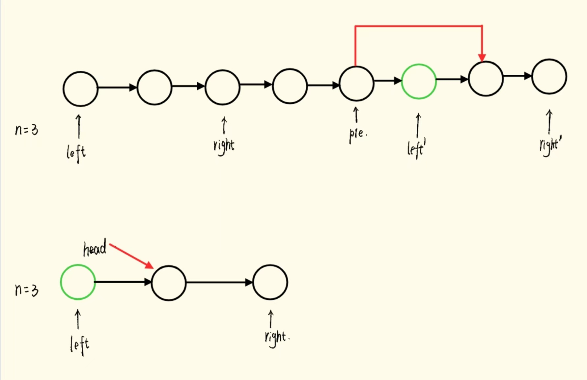

[删除链表的倒数第N个结点](https://leetcode.cn/problems/remove-nth-node-from-end-of-list/?envType=study-plan-v2&envId=top-100-liked)

给你一个链表，删除链表的倒数第`n`个结点，并且返回链表的头结点。

**进阶：**你能尝试使用一趟扫描实现吗？

$Solution$：
- 想象有一把长度固定的尺子，左端点在链表头部，右端点在正数第 $n$个节点。向右移动尺子，当尺子右端点到达链表最后一个结点时，左端点就在倒数第 $n$个节点。


- 由于`head`本身相当于第一个结点，因此我们只需要让`right`在开始的时候提前走 $n-1$步即可，我们不断地去检验`right -> next`是否为空即可，当`right -> next`为空地时候就意味着此时`left`指向的是要删除的节点。在整个过程中，利用`pre`指针一直指向`left`的前一个结点，方便我们后续直接通过改变指向(`pre -> next = left -> next`)来删除`left`。

- 当 $n$恰好等于链表长度的时候，即当完成`right`的提前走 $n-1$步后，如果`right -> next == NULL`，要删除的结点就是头结点`head`。由于最终要返回的是头结点`head`，因此我们要改变`head`的指向，不能再通过`pre`来完成这个操作。

```cpp
/**
 * Definition for singly-linked list.
 * struct ListNode {
 *     int val;
 *     ListNode *next;
 *     ListNode() : val(0), next(nullptr) {}
 *     ListNode(int x) : val(x), next(nullptr) {}
 *     ListNode(int x, ListNode *next) : val(x), next(next) {}
 * };
 */
class Solution {
public:
    ListNode* removeNthFromEnd(ListNode* head, int n) {
        n--;
        ListNode* right = head;
        while (n--) {
            right = right -> next;
        }
        if (right -> next) {
            ListNode* left = head;
            ListNode* pre = nullptr;
            while (right -> next) {
                pre = left;
                left = left -> next;
                right = right -> next;
            }
            pre -> next = left -> next;
        } else {
            head = head -> next;
        }
        return head;
    }
};
```