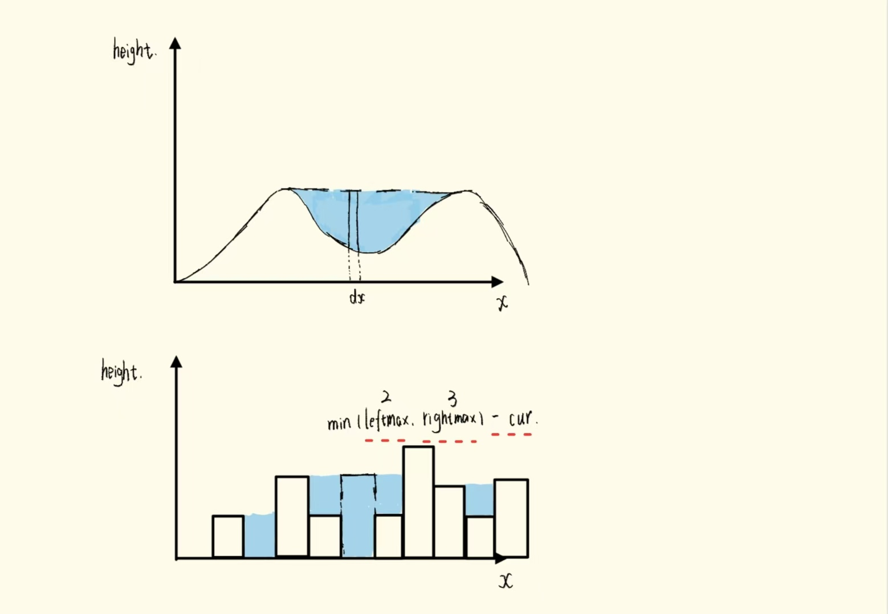

[接雨水](https://leetcode.cn/problems/trapping-rain-water/?envType=study-plan-v2&envId=top-100-liked)

给定`n`个非负整数表示每个宽度为`1`的柱子的高度图，计算按此排列的柱子，下雨之后能接多少雨水。



$Solution$：

- 上述图片中描述的就是题目要要求，我们要在给定`height`的前提下，求解出蓝色部分的面积总和。

- 这道题我认为关键点或者说值得思考的点就在于，我们怎么确定每一个下标为`i`的位置的积水是多少，，我们将下表为`i`的部分视作一个水桶，那么这个水桶的容积的高度由左边的最大高度和右边最大高度的最小值决定，同时需要减去自己本身的高度，即`min(leftMax, rightMax) - height[i]`。

- 因此我们可以利用两个数组分别存储前缀最大值和后缀最大值，此后再次遍历一遍，这一次我们就可以按照上面的公式进行计算了。

```go
func trap(height []int) int {
    var length int = len(height)
    preMax := make([]int, length)
    sufMax := make([]int, length)
    preMax[0] = height[0]
    sufMax[length - 1] = height[length - 1]
    for i := 1; i < length; i++ {
        preMax[i] = max(preMax[i - 1], height[i])
    }
    for i := length - 2; i > -1; i-- {
        sufMax[i] = max(sufMax[i + 1], height[i])
    }
    var ans int = 0
    for i := 1; i < length - 1; i++ {
        ans += min(preMax[i], sufMax[i]) - height[i]
    }
    return ans
}
```

- 但是我们可以发现，前缀最大值它并不完全等于前缀和，因为它只是一个单独的值，如果我们从两端向中间遍历，我们只需要保存着我们即将要遍历的索引的左边的最大高度和右边的最大高度即可，我们只需要两个临时变量就可以存储。

- 那么从两端向中间进行遍历的过程中，我们的更新策略是什么？这个问题的本质是，谁不更新可能会影响另一端的积水面积？例如`i=1`，`j=5`时，我们知道`i=1`的左边的最大高度是 $2$，`j=5`的右边最大高度是 $2$，并且`height[i]=3`且`height[j]=5`，那么我们应该移动谁呢？

- 答案是移动高度较小的那一端，对于上面的例子就是计算`i`所处的面积，然后将`i`右移。为什么这么处理是对的？因为我们知道此时右边一定有比`height[i]`大的高度存在，即使可能不是`j`这个位置的，但`sufMax≥height[j]>height[i]`，因此`i`这里的这个木桶，一定是由前缀最大值决定的。

```cpp
#include <iostream>
#include <vector>
#include <algorithm>

class Solution
{
public:
    int trap(std::vector<int> &height)
    {
        int ans = 0;
        int left = 0;
        int right = height.size() - 1;
        int preMax =0;
        int sufMax = 0;
        while (left < right)
        {
            if (height[left] < height[right])
            {
                preMax = std::max(preMax, height[left]); // 先更新较小的高度，避免相减时出现负数的情况
                ans += preMax - height[left];
                // std::cout << "i = " << left << ", " << preMax - height[left] << std::endl;
                left++;
            }
            else
            {
                sufMax = std::max(sufMax, height[right]);
                ans += sufMax - height[right];
                // std::cout << "i = " << right << ", " << preMax - height[left] << std::endl;
                right--;
            }
        }
        return ans;
    }
};

int main() {
    Solution solution = Solution();
    std::vector<int> height = {4, 2, 0, 3, 2, 5}; // ans = 9
    int ans = solution.trap(height);
    std::cout << ans << std::endl;
    return 0;
}
```